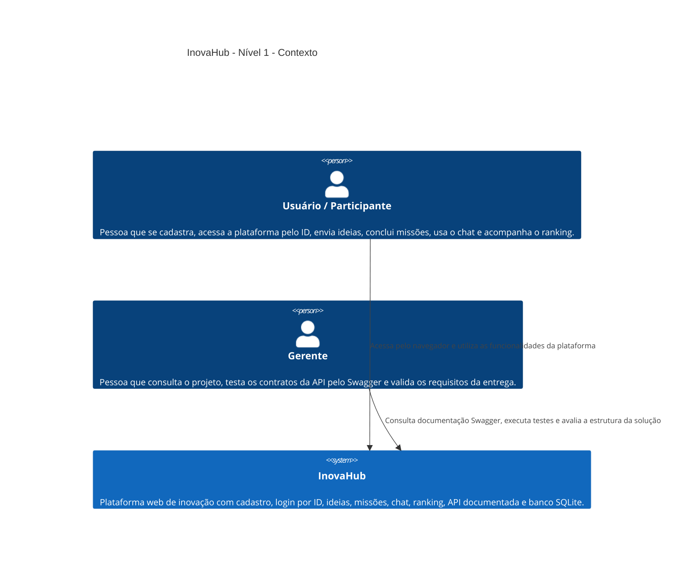

# Diagrama C4 - Nível 1 - Contexto

Este diagrama apresenta a visão geral do **InovaHub** e como os usuários interagem com a solução.

## Descrição

No nível de contexto, o InovaHub é visto como um único sistema.

A solução permite que o usuário:

- realize cadastro com nome e e-mail;
- utilize o ID retornado no cadastro ou no Swagger para fazer login;
- acesse o dashboard;
- cadastre ideias;
- conclua missões;
- envie mensagens no chat;
- consulte ranking e pontuação.

O professor ou avaliador pode acessar o Swagger para validar os contratos da API e executar os testes do projeto.
