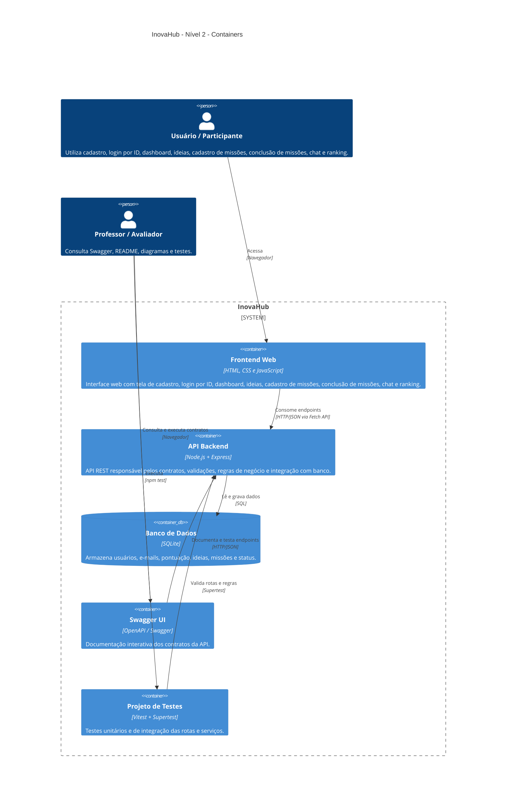

# Diagrama C4 - Nível 2 - Containers

Este diagrama apresenta os principais containers da solução **InovaHub**.



## Containers

### Frontend Web

Responsável pela interface do usuário.

Telas principais:

- `index.html`: tela inicial com cadastro e login;
- `dashboard.html`: tela principal do usuário após login;
- telas/seções de ideias, missões, chat e ranking.

O login do frontend usa o **ID do usuário** criado no cadastro ou retornado pelo Swagger.

### API Backend

Responsável pelas rotas REST:

- `/api/users`
- `/api/users/ranking`
- `/api/ideas`
- `/api/missions`
- `/api/chat`
- `/health`
- `/api-docs`

### Banco SQLite

Banco local usado para persistência dos dados do projeto.

Armazena:

- usuários;
- e-mails;
- pontuação;
- ideias;
- missões;
- status das ideias.

### Swagger UI

Interface para consultar e testar os contratos da API.

Disponível em:

```text
http://localhost:3000/api-docs
```

### Projeto de Testes

Executado com:

```bash
npm test
```

Contempla testes unitários e de integração.
