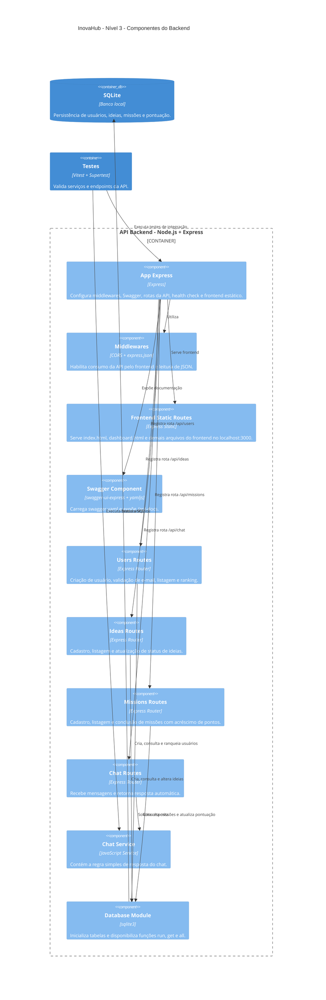

# Diagrama C4 - Nível 3 - Componentes

Este diagrama detalha os principais componentes internos do backend do **InovaHub**.



## Componentes principais

### App Express

Arquivo principal da aplicação backend. Ele configura:

- CORS;
- leitura de JSON;
- Swagger;
- rotas da API;
- health check;
- frontend estático;
- tratamento de erros.

### Users Routes

Responsável por:

- cadastrar usuário;
- validar nome obrigatório;
- validar e-mail;
- impedir e-mail duplicado;
- listar usuários;
- listar ranking.

Endpoints:

```text
POST /api/users
GET /api/users
GET /api/users/ranking
```

### Ideas Routes

Responsável por:

- cadastrar ideias;
- listar ideias;
- atualizar status;
- adicionar pontos ao usuário ao cadastrar ideia.

Endpoints:

```text
POST /api/ideas
GET /api/ideas
PATCH /api/ideas/{id}/status
```

### Missions Routes

Responsável por:

- cadastrar novas missões;
- listar missões ativas;
- concluir missão;
- adicionar pontos ao usuário.

Endpoints:

```text
GET /api/missions
POST /api/missions
POST /api/missions/{id}/complete
```

### Chat Routes e Chat Service

Responsáveis por receber uma mensagem e devolver uma resposta automática.

Endpoint:

```text
POST /api/chat
```

### Database Module

Responsável por:

- conectar ao SQLite;
- criar tabelas;
- inicializar missão padrão;
- disponibilizar funções de consulta e gravação.

Tabelas principais:

- `users`
- `ideas`
- `missions`

### Testes

O projeto utiliza:

- **Vitest** para execução dos testes;
- **Supertest** para testes de integração das APIs.

Execução:

```bash
npm test
```
